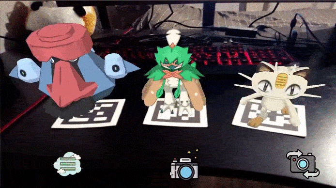
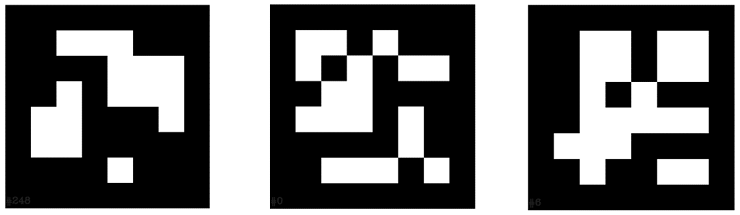
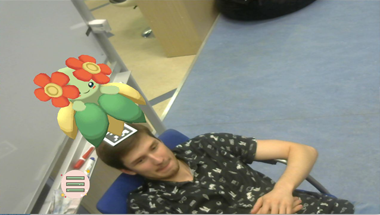
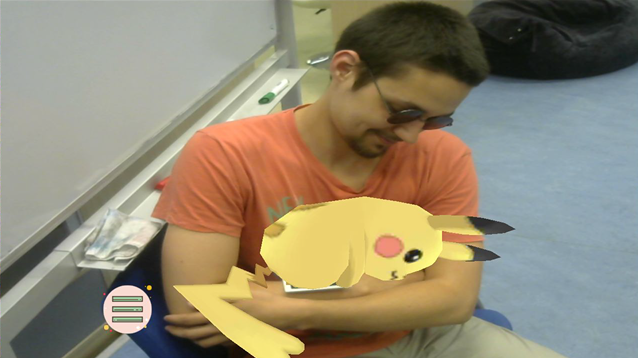
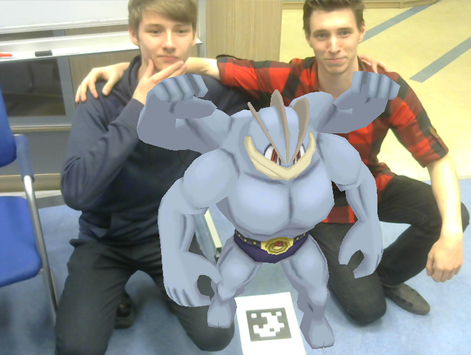
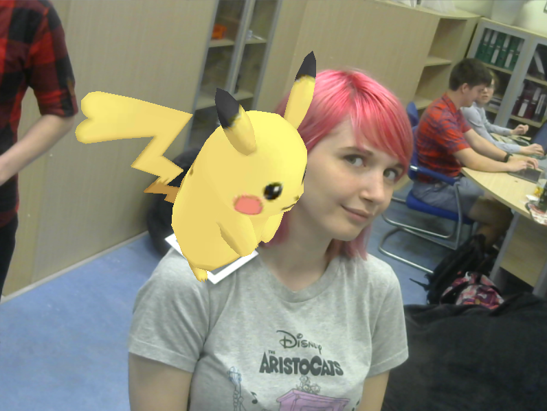
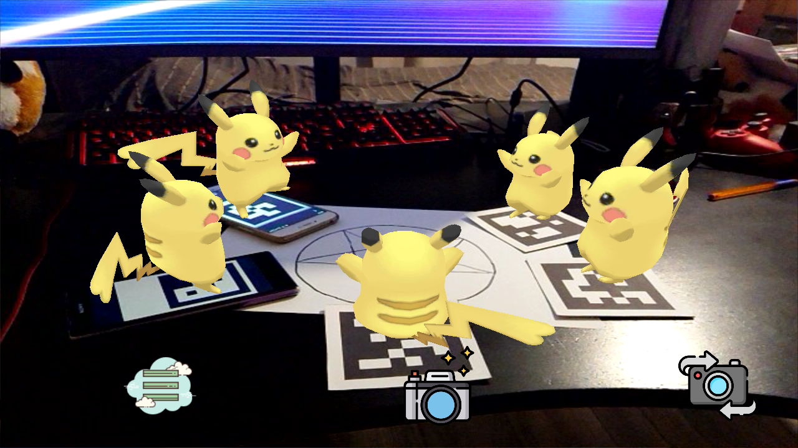
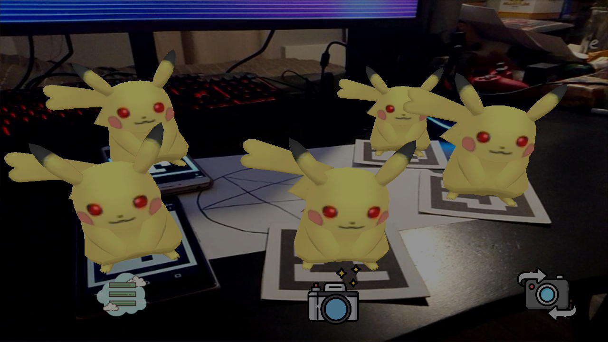
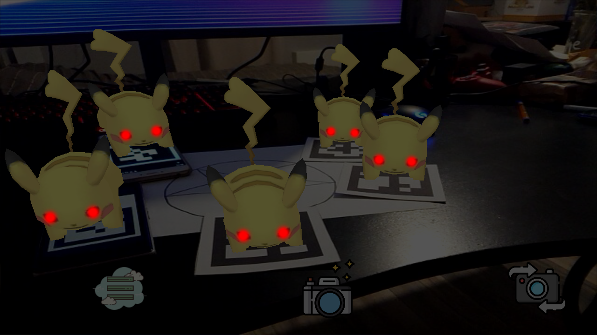

# PokeRanch

PokeRanch - это приложение, которое умеет отображать модели покемонов в дополненной реальности (AR).  
Происходит это с помощью привязки к маркеру (используются маркеры типа **ARUCO_MIP_36h12**). У каждого маркера есть свой номер, к которому привязана определённая модель покемона.  

Скачать маркеры можно со [страницы загрузок ArUco](https://sourceforge.net/projects/aruco/files/)

У каждой модели есть свой набор анимаций, которые вы можете переключать.

Также вы можете поиграться с размером модели.

Ну и конечно же устроить незабываемую фотосессию :)

## Используемые технологии:
- OpenGL
- OpenCV
- GLFW
- Assimp
- Aruco

Icons made by <a href="https://www.freepik.com/" title="Freepik">Freepik</a> from <a href="https://www.flaticon.com/" 			    title="Flaticon">www.flaticon.com</a> is licensed by <a href="http://creativecommons.org/licenses/by/3.0/" 			    title="Creative Commons BY 3.0" target="_blank">CC 3.0 BY</a>

## Разработчики:
- [Лебедев Александр](https://github.com/CheerfulMushroom) - интерфейс, архитектура
- [Четверов Антон](https://github.com/chtvrv) - работа с моделями и рендеринг
- [Живолуп Максим](https://gitlab.com/Purple_Lime) - обработка маркеров, работа с моделями

## Менторы:
- [Ольга Зудина](https://github.com/LeKaitoW)
- [Соколов Владислав](https://github.com/Falcon22)